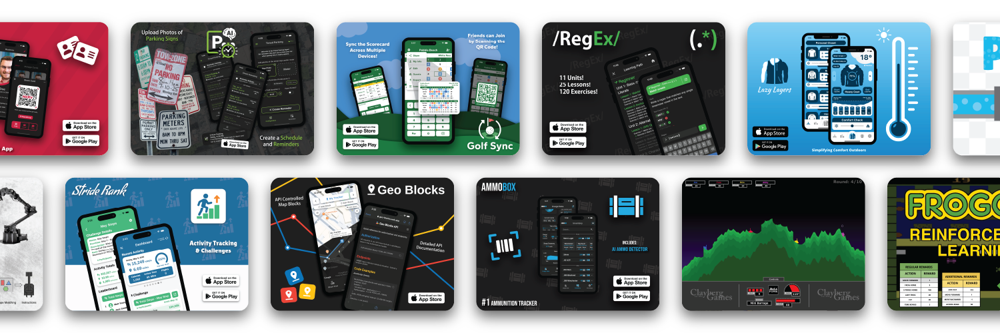

# 👋 Hi, I'm Lee Clayberg

I'm a software engineer, mobile app developer, and lifelong builder who loves turning ideas into polished, real, usable products. I’ve built apps, games, tools, and even hardware projects across iOS, Android, Flutter, Unity, machine learning, and embedded systems.

For over a decade, I’ve created 80+ projects ranging from AI-powered apps to physics-based puzzle games, robotics experiments, and full-stack platforms — and I’m still building every day.

# 🚀 What I Build
## 📱 Mobile Apps (iOS / Android / Flutter)
* Ammo Box – A smart ammo tracking + barcode scanning app
* RegEx – Learning – A gamified way to learn regular expressions
* Move My Car – Push notifications to avoid street-sweeping tickets
* Pipes: Connect the Flow – A 3D puzzle game with 150+ levels
* Golf Sync – Golf scorecard tracking (in progress)

## 🎮 Games & Graphics
* Temple of Powers – Ability-based platformer built in Unity
* Block Shift – Swipe to fit through walls
* Spherical Maze Generator – Procedural maze wrapped around a sphere
* Skyward Towers – From Flash → to full Unity mobile game

# 🌟 What I'm Currently Working On
* Golf tournament tracking software for my own golf group
* Improvements to my RegEx - Learning app

# 📬 Connect With Me
* Website: https://www.leeclayberg.com
* X (Twitter): https://x.com/leeclayberg
* Projects: https://www.leeclayberg.com/projects

💡 Fun Facts
* Eagle Scout 🦅
* Northeastern CS grad
* Built 10+ mobile apps and 80+ projects over 10 years
* I once saved myself a $100 parking ticket thanks to my own app
* I still have my first project from 2014 — a parents’ open house website
